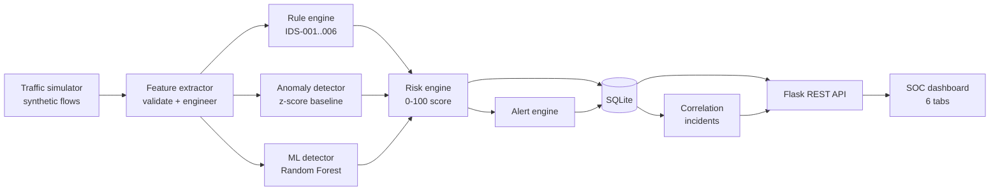

# Architecture

## Data flow

## Module map
| Path | Responsibility |
|---|---|
| `simulator/generate_dataset.py` | Creates `data/network_traffic.csv` (6,000 flows, 11 scenarios) |
| `simulator/traffic_simulator.py` | Emits live flow records; optional localhost-only POST |
| `ids/feature_extractor.py` | Validation, missing-value handling, 15 features |
| `ids/rule_engine.py` | Configurable signature rules and signature score |
| `ids/anomaly_detector.py` | Baseline fit + anomaly score |
| `ids/risk_engine.py` | Weighted risk, risk level, classification, severity |
| `ids/alert_engine.py` | Alert object, reason, investigation steps |
| `ids/correlation.py` | Groups alerts into incidents (source IP + type, 60 s gap) |
| `ml/train_model.py` | Trains/evaluates 3 models, saves `models/ids_rf.joblib` + `metrics.json` |
| `ml/predict.py` | Batch probability from the saved Random Forest |
| `ml/evaluate.py` | Rules vs anomaly vs hybrid report -> `reports/model_evaluation.md` |
| `backend/services.py` | Pipeline orchestration, SQLite access, dashboard queries |
| `backend/app.py` | REST endpoints, validation, optional API key |
| `frontend/index.html` | Tabbed dashboard and investigation drawer |

## Database schema (SQLite)
| Table | Key columns |
|---|---|
| `network_flows` | flow_id (PK), timestamp, IPs, ports, protocol, counts, signature/anomaly/ml/risk scores, risk_level, classification, label, scenario_type |
| `alerts` | alert_id (PK), flow_id (FK), rule_id, alert_type, severity, risk_score, status, created_at, updated_at |
| `rules` | rule_id (PK), rule_name, description, severity, threshold (JSON), enabled |
| `incident_notes` | note_id (PK), alert_id (FK), note, created_at (also stores status-change timeline) |
| `model_results` | result_id (PK), flow_id, model_name, prediction, score |

Indexes: flow timestamp and source IP; alert timestamp and (severity, status); notes by alert.

## Runtime behaviour
- Startup: initialise DB, load rules, fit anomaly baseline from normal rows, load model, seed ~1,800 flows (re-timed across the last 3 hours), start a background simulator (3 flows/s by default).
- Each run starts with a fresh database unless `IDS_RESET=0`.
- Dashboard polls the API every 3 seconds; it pauses while typing or when the drawer is open.

## Environment variables
| Variable | Default | Purpose |
|---|---|---|
| `PORT` | 5000 | Server port |
| `SIM_INTERVAL` | 1.0 | Seconds between simulated batches |
| `SEED_FLOWS` | 1800 | Flows loaded at startup |
| `AUTO_SIM` | 1 | Set 0 to stop the background simulator |
| `IDS_RESET` | 1 | Set 0 to keep the database between runs |
| `IDS_DB` | `data/ids.db` | Database path |
| `IDS_API_KEY` | unset | If set, `POST /api/flows` needs header `X-API-Key` |
